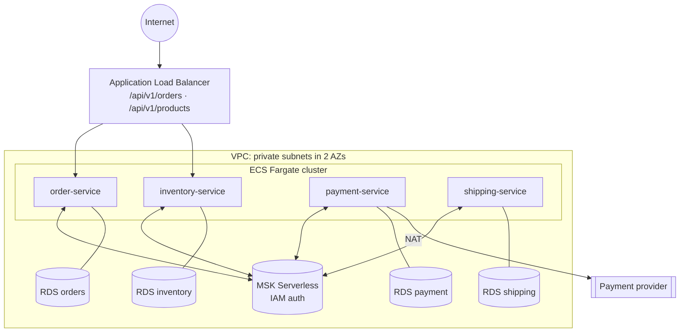

# AWS Infrastructure (live)

[](https://github.com/alef2509/aws-infra-live/actions/workflows/ci.yml)


Environment configuration (`dev`, `prod`) that deploys the
[event-driven e-commerce saga](https://github.com/alef2509/ecommerce-microservices-kafka-saga)
to AWS, composed from the versioned
[terraform-aws-modules](https://github.com/alef2509/terraform-aws-modules) (`v1.0.0`).

> **Portfolio note:** this repository is validated, linted and security-scanned in CI,
> but it is **not applied**. The workflows and bootstrap are ready for a real
> account; see [Going live](#going-live).

## What gets deployed



- **Database per service**: four RDS PostgreSQL instances; each one only accepts its own service.
- **Kafka**: MSK Serverless with IAM authentication. Each service's task role gets a
  least-privilege policy scoped to this cluster.
- **Secrets**: database credentials are generated and rotated by Secrets Manager and
  injected by ECS at start. They never appear in Terraform state, variables or images.
- **Outbox relay**: Kafka Connect/Debezium is not deployed on AWS; the services use their
  built-in polling relay (`OUTBOX_RELAY=polling`), which publishes identical messages.
  This is the trade-off documented in the application's ADR 2.
- **Only two services are public** (orders, products). Payment and shipping have no
  load balancer route.

## Environments

| | dev | prod |
|---|---|---|
| NAT gateways | 1 (shared) | 1 per AZ |
| Fargate | 70 % Spot | on-demand only |
| Tasks per service | 1-2 | 2-10 |
| Databases | `db.t4g.micro`, single-AZ, 1-day backups, deletion protection | `db.m7g.large`, **Multi-AZ**, 14-day backups, deletion protection |
| Log retention | 14 days | 90 days |
| Load balancer | HTTP | HTTPS (ACM certificate), HTTP → HTTPS redirect |

The differences live in a dozen lines of [`environments/*/main.tf`](environments); the
whole topology is shared in [`modules/ecommerce-platform`](modules/ecommerce-platform).

## Repository layout

```
bootstrap/                      run once per account: state bucket + GitHub OIDC roles
modules/ecommerce-platform/     the platform, composed from terraform-aws-modules@v1.0.0
environments/dev|prod/          backend, provider guard rails, sizing per environment
.github/workflows/ci.yml        validate, lint, checkov; plan on PRs when AWS access is configured
.github/workflows/apply.yml     manual, reviewer-gated apply per environment
```

## Safety rails

- **State**: S3 with versioning, encryption, TLS-only bucket policy, public access
  blocked and **native S3 locking** (`use_lockfile`, no DynamoDB table needed since
  Terraform 1.10).
- **Wrong account protection**: `allowed_account_ids` makes the provider refuse to run
  against any other account.
- **Keyless CI**: GitHub Actions assumes IAM roles through OIDC. No access keys exist.
  - the **plan** role (read-only + state lock) trusts pull requests of this repo only;
  - the **apply** role trusts only the `dev` and `prod` GitHub **environments**, which
    require a reviewer before the job starts.
- **Pinned modules**: sources reference the commit of `v1.0.0` (a tag can be moved, a commit
  cannot), so upgrades are explicit, reviewable pull requests.

## CI

| Job | What | Credentials |
|---|---|---|
| Validate | `init -backend=false` + `validate` for dev, prod and bootstrap | none |
| Lint | `fmt -check`, `tflint` (AWS ruleset), `checkov` incl. downloaded modules ([exceptions](.checkov.yaml)) | none |
| Plan | `terraform plan` per environment, summary on the PR | OIDC, read-only; **skipped** until `AWS_PLAN_ROLE_ARN` is set |

## Going live

1. `cd bootstrap && terraform init && terraform apply` with an administrator profile.
2. Put the account id in `environments/*/terraform.tfvars`.
3. Set the repository variable `AWS_PLAN_ROLE_ARN`, and `AWS_APPLY_ROLE_ARN` on the
   `dev`/`prod` GitHub environments (with required reviewers).
4. Publish the service images to `ghcr.io/alef2509/<service>:<tag>`.
5. Add `software.amazon.msk:aws-msk-iam-auth` to the services' dependencies. The SASL/IAM
   client settings are already passed as `SPRING_KAFKA_PROPERTIES_*` environment variables.
6. Run the **Apply** workflow for `dev`.

## License

[MIT](LICENSE)
